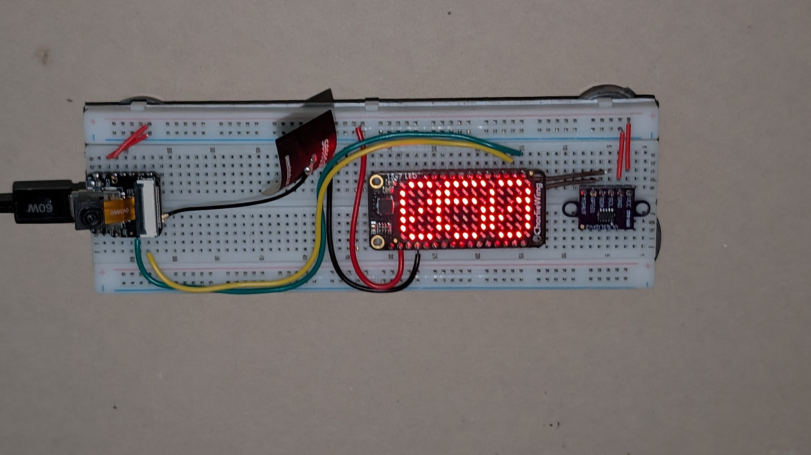
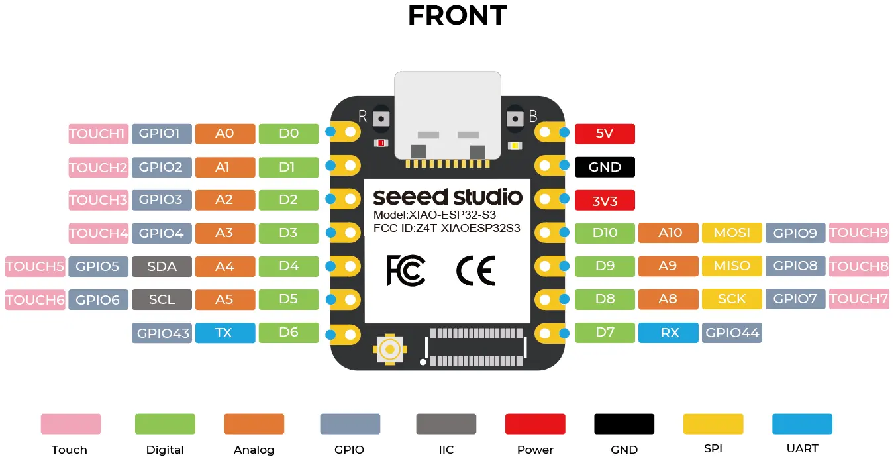
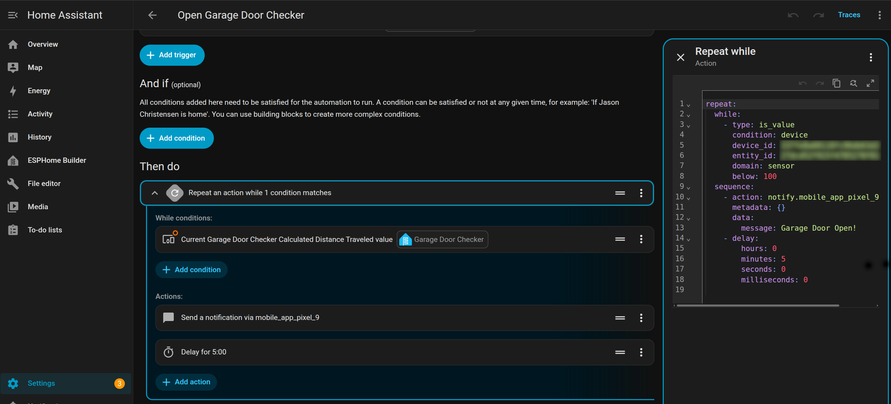

# Open Garage Door Detector using Xiao ESP32S3 and VL53L0X in Home Assistant

The purpose of this project was to detect an open garage door for an extended period of time.

The project makes use of [Home Assistant](https://www.home-assistant.io/) running on a Raspberry Pi 4 and the `Open Garage Door Detector Hardware` listed below.  The Home Assistant has [ESPHome](https://www.home-assistant.io/integrations/esphome/) installed.

### How it Works
The `Open Garage Door Detector Hardware` makes use of a `VL53L0X is a miniature Time-of-Flight (ToF) laser-ranging sensor` that is attached to the ceiling of the garage.  When the garage door is down the sensor reads a distance greater than 800cm.  When the garage door is up the sensor reads a distance less than 100cm.  The distance measurements are sent to Home Assistant periodically.

In Home Assistant, an automation is configured to detect when the garage door is open.  If Home Assistant detects that the garage door is open for more than 5 minutes it sends a notification to my phone.  The notification is repeated every 5 minutes until the garage door is closed.

## Open Garage Door Detector Hardware
- [Xiao ESP32S3](https://www.seeedstudio.com/XIAO-ESP32S3-p-5627.html?srsltid=AfmBOoqI0EVJBk83V41QB1V8agkXB1HZAmPeqdZBqnwNcks07gTt72vZ)
- [VL53L0X](https://www.amazon.com/Qoroos-VL53L0X-Breakout-GY-VL53L0XV2-Measurement/dp/B0DP6893DS/ref=sr_1_1_sspa?crid=2DXRHOYAI4X5C&dib=eyJ2IjoiMSJ9.mt2neMEiDHu3alHNS1n_YW72WpZ24fB-LYLs2f7wYi8ltU1HR-F-KiwJyIu8ZKw48FkIUPhufHYhqqzbPMwH6MmV0nKCgGoMncjGfE6ka0MaCwMPl1K1y6YZpSFa3VRZeruD8o8_dDFV8pSuREpxbx8epnHiMa2hLm3ifqwkO-g_uE8hycUQkN-g7Usx6UC8oU3S6CEZ9XNjtPe8h_zdWbrIWNuhp3vFxMeEoVcmuoA.lkiSUmkqzzEzUFM4HIpT3ksl-MR91bXuqJ7nAS3FHbY&dib_tag=se&keywords=VL53L0X&qid=1781999648&sprefix=vl53l0x%2Caps%2C117&sr=8-1-spons&sp_csd=d2lkZ2V0TmFtZT1zcF9hdGY&th=1)
- [Adafruit 15x7 CharliePlex LED Matrix Display FeatherWing](https://www.adafruit.com/product/3134)
  - The LED is not necessary.  It was convenient while prototyping so I left it in.
- USB-C charger and cord.
- Breadboard 
- Magnets are attached to the back of the breadboard.  Another set of magnets are attached to the garage ceiling.  This makes it easy to remove if necessary.

### Wiring

- ESP32 3V3 Pin:
  - VL53L0X VCC
  - FeatherWing VCC

- ESP32 Ground Pin:
  - VL53L0X Ground
  - FeatherWing Ground

- ESP32 SDA Pin:
  - VL53L0X SDA
  - FeatherWing SDA

- ESP32 SCL Pin:
  - VL53L0X SCL
  - FeatherWing SCL

## Software
I used the Arduino framework for this sensor because that is what I used to prototype the project before developing on ESP32 Home Assistant.  Also the Arduino framework has many libraries that I can make use of in future projects.

A function is called periodically that does the following:
- Read the current distance
- Updates the LED display with the current distance measurement.  Units in cm.
- Publishes the distance measurement to Home Assistant

## Automation
An automation was created in Home Assistant.  If if 5 minutes has elapsed and the distance measurement is below 100 cm it will send a notification to my phone.  The notification is then sent every 5 minutes as long as the distance measurement is below 100 cm.

  

  

